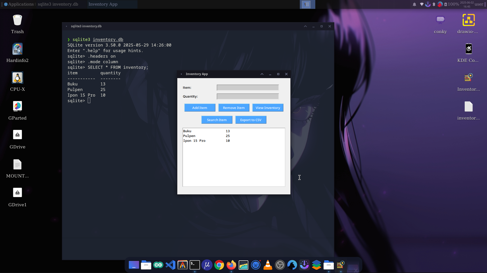

# <h1 align="center">Preview</h1>


# <h1>Overview 👀</h1>
<li>Python based app and sqlite database already pre-installed</li>
<li>Quick installation and ready to use</li>

# <h2>🪧NOTE🪧</h2>
<li>This app is under development</li>
<li>Already testing in Arch linux system</li>

# <h2>📦Whats new?</h2>
<li>CRUD features</li>
<li>Messages box that informs data changes</li>
<li>Export to csv</li>
<li>Search button</li>

# <h2>💥Installation💥</h2>
<li>Clone this repo from main branch to your directory</li>
</br>

```
https://github.com/17frn/inventoryApp.git
```

</br>
<li>Open <b>inventoryApp</b> folder from terminal</li>
<li>Do</li>
</br>

```
./inventory_app
```
</br>
<li>Make sure you've already give permission into these files</li>
</br>

```
chmod +x ./inventory_app
```
